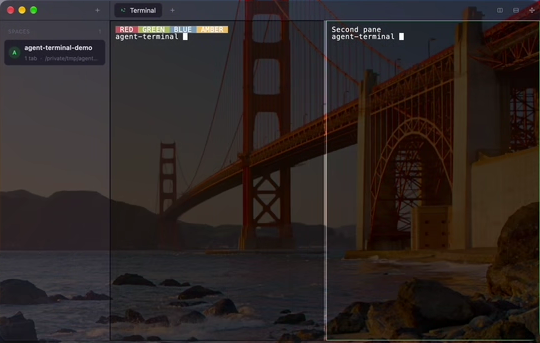
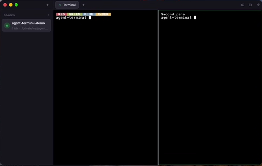

# Issue #56 platform material evidence

## Windows

Validated on Windows 11 Pro 26H2, build 26300.8935, from the PR #64 branch.

The initial Mica result was rejected because it appeared effectively opaque.
The Windows default now uses Acrylic with 65% shell and default-terminal
surface opacity. The operator approved that appearance in a live build with
`AGENT_TERMINAL_BACKGROUND_OPACITY` unset. The explicit value `1` continues to
select the opaque window and surface path.

The superseded Mica and opaque screenshots were removed. Fresh app-only
captures can be added when the Windows capture helper is available again.

## Interactive validation

- Minimize/reactivate and maximize/restore worked through the native titlebar
  controls.
- Dragging the integrated titlebar moved the window, including while terminal
  output was streaming.
- The sidebar seam resized from 220 px to 300 px.
- Creating a horizontal split and dragging its pane seam changed the split
  position from approximately 50% to 61%.
- Explicit red, green, blue, and amber ANSI cell backgrounds remained opaque.
- The terminal cursor remained an opaque block.
- The window, titlebar controls, sidebar seam, and pane seam stayed responsive
  during 1,000 terminal repaints paced at 16 ms (approximately 60 frames per
  second).

## Automated validation

- `cargo fmt --all -- --check`
- `cargo check --locked`
- `cargo test --locked --profile test -- --test-threads=1` (78 unit tests and
  10 integration tests)
- `cargo clippy --locked --profile test --all-targets -- -D warnings`

Parallel test attempts timed out in existing shell/process tests under Windows
resource contention. Each initially failing test passed in isolation, the
integration suite passed serially, and the complete serial run passed all 88
tests.

## macOS

With `AGENT_TERMINAL_BACKGROUND_OPACITY` unset, the native blurred window path
keeps the desktop visible through the workspace shell and default terminal
surface:

With `AGENT_TERMINAL_BACKGROUND_OPACITY=1`, a fresh process resolves the same
workspace as fully opaque:

Interactive validation covered native minimize and restore, integrated-titlebar
window movement, horizontal pane creation, and dragging the pane seam from an
equal split to approximately 29%. Explicit red, green, blue, and amber ANSI
backgrounds and both cursor blocks stayed opaque in the translucent path.

The automated macOS gate passed:

- `cargo fmt --all -- --check`
- `cargo check --locked`
- `cargo test --locked --profile test` (77 unit tests and 11 integration tests)
- `cargo clippy --locked --profile test --all-targets -- -D warnings`

## Linux

The automated Linux gate passed on the current branch head:

- `cargo fmt --all -- --check`
- `cargo check --locked`
- `cargo test --locked --profile test` (77 unit tests and 11 integration tests)
- `cargo clippy --locked --profile test --all-targets -- -D warnings`

Wayland material and opaque-fallback visual evidence remains pending on a
graphical Linux session.
