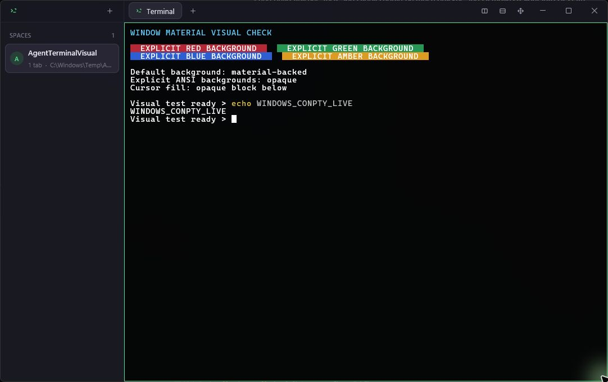
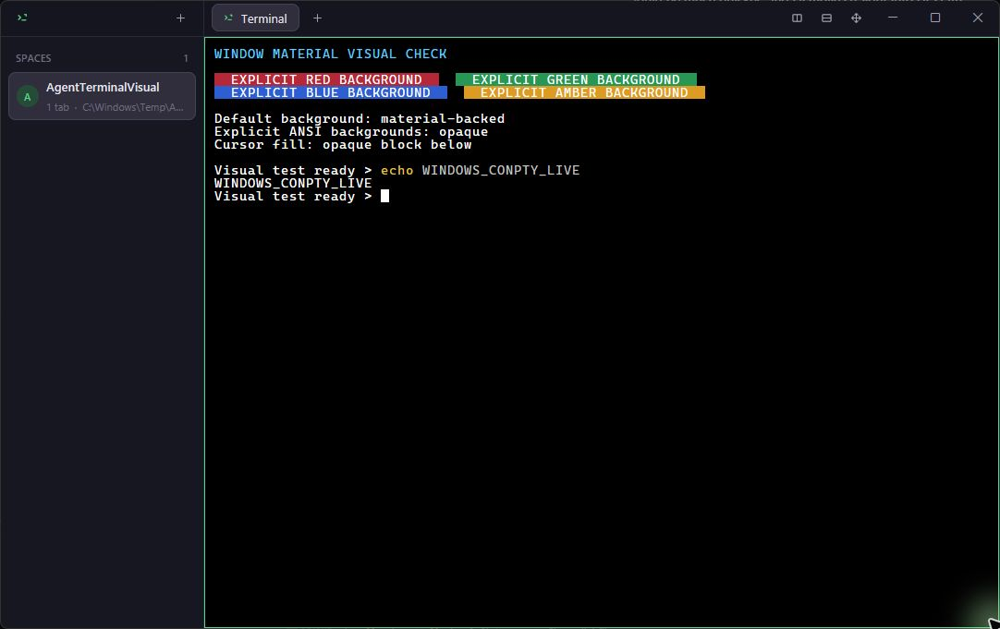

# Issue #56 Windows material evidence

Captured on Windows 11 Pro 26H2, build 26300.8935, from the PR #64 branch.
Both captures contain only the application window and use an isolated,
deterministic ConPTY shell fixture with non-private display content.

## Default Windows 11 Mica

`AGENT_TERMINAL_BACKGROUND_OPACITY` was unset, selecting the default 82%
surface opacity and the Windows 11 Mica backdrop.

## Opaque override

`AGENT_TERMINAL_BACKGROUND_OPACITY=1` selected the opaque window and surface
path.

## Interactive validation

- Minimize/reactivate and maximize/restore worked through the native titlebar
  controls.
- Dragging the integrated titlebar moved the window, including while terminal
  output was streaming.
- The sidebar seam resized from 220 px to 300 px.
- Creating a horizontal split and dragging its pane seam changed the split
  position from approximately 50% to 61%.
- Explicit red, green, blue, and amber ANSI cell backgrounds remained opaque.
- The terminal cursor remained an opaque block.
- The window, titlebar controls, sidebar seam, and pane seam stayed responsive
  during 1,000 terminal repaints paced at 16 ms (approximately 60 frames per
  second).

## Automated validation

- `cargo fmt --all -- --check`
- `cargo check --locked`
- `cargo test --locked --profile test` (78 unit tests and 10 integration tests)
- `cargo clippy --locked --profile test --all-targets -- -D warnings`

The first cold-target parallel test pass followed a full dependency compile and
timed out in four existing shell/process tests under resource contention. An
immediate rerun of the exact test command from the warm target passed all 88
tests.
